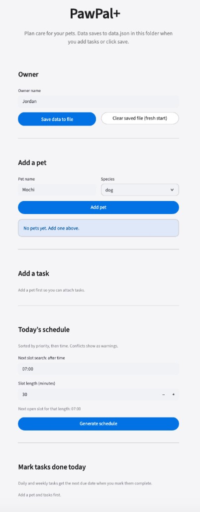

PawPal+ (Module 2 Project)

This project is a Streamlit app that helps a pet owner plan care tasks for their pets.

Scenario

A busy pet owner needs to stay consistent with pet care. They want to track tasks like walks, feeding, and meds, work within time and preferences, and get a clear daily plan.

You design the system, implement the logic in Python, then connect it to Streamlit.

Features

The owner can have more than one pet. Each pet has a name, species, and a list of tasks. Each task has a description, clock time in HH:MM form, how often it repeats, a due date, done or not, a priority level (low, medium, high), and a duration in minutes for scheduling gaps.

The scheduler sorts today’s open tasks by priority first then time. It can filter by completion or pet name. It warns when two tasks start at the same clock time. When you finish a daily or weekly task it adds the next occurrence. It also exposes a simple weighted score helper and a next-available time slot finder that respects task durations. The owner can save and load everything to data.json.

The Streamlit app loads data.json on startup if it is present, saves after changes, and includes a clean layout with schedule table, conflict warnings, next-slot hint, and mark-done actions.

Optional extensions added in one pass

Priority scheduling, JSON persistence on Owner, next open slot search, tabulate output in main.py, a weighted score function for tasks, and a short prompt-comparison note in reflection.md. data.json is gitignored so your local data is not forced into the repo unless you remove that line.

Smarter scheduling

See pawpal_system.py for sorting, filtering, conflicts, recurrence, save and load, priority plus time ordering, and next slot logic.

Testing PawPal+

From the project folder (activate your venv first if you use one):

```
python -m pytest
```

The tests cover the core behaviors plus priority ordering, JSON round trip, and next-slot behavior.

I would rate my confidence around 4 out of 5 for normal use. Conflict checks still use the same start time, not overlapping durations unless you use the slot finder which uses duration.

Demo

Run the app with:

```
streamlit run app.py
```

CLI demo with formatted tables:

```
python main.py
```

Screenshot of the running app:



UML

The Mermaid source for the class diagram is in uml_final.mmd. The exported image is uml_final.png.

Getting started

Setup:

```
python -m venv .venv
source .venv/bin/activate
pip install -r requirements.txt
```

On Windows use .venv\Scripts\activate instead of source.

Suggested workflow: read the scenario, sketch UML, add class stubs, implement scheduling in small steps, add tests, connect app.py, then align the diagram with the final code.
